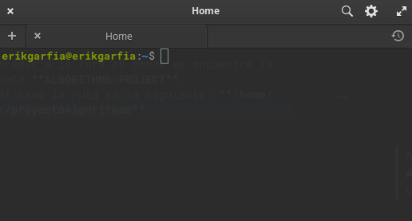
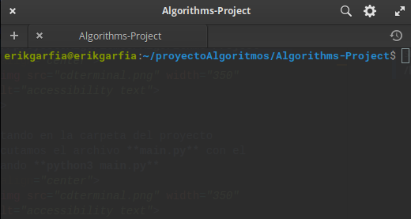
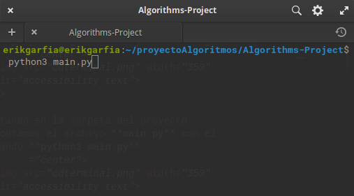
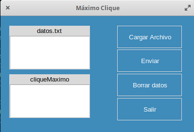
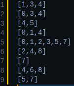
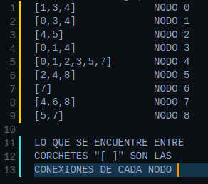
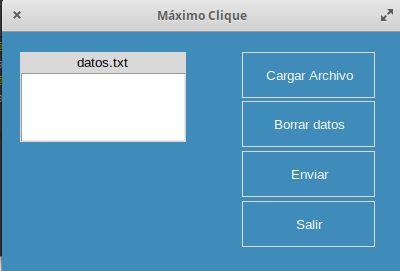
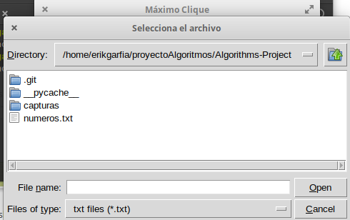
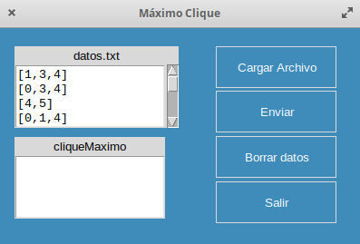

# Máximo Clique
Autores:
### Garfia Acevedo Erik
### Medero Luján Alejandro

Para compilar el archivo:
> abrir una terminal, te encontrarás en la carpeta raíz de tu terminal

  

> Acceder a la ruta en donde se encuentra la carpeta **ALGORITHMS-PROJECT**.
En mi caso la ruta es la siguiente: **/home/user/proyectoAlgoritmos/Algorithms-Project**

  

>Estando en la carpeta del proyecto ejecutamos el archivo **main.py** con el comando **python3 main.py**

  

>Y obtendremos una salida como la siguiente, dando inicio a la interfaz gráfica.

  

>En la carpeta se encuentra un archivo llamado **numeros.txt** es un ejemplo de un grafo, el cual viene estructurado de la siguiente manera

  

  

>Ahora cargamos el archivo **numeros.txt** presionando el botón **Cargar Archivo**

  

>Y nos aparecera una ventana como la siguiente, en la que nos abrirá de manera inmediata la ruta de la carpeta donde se encuentra el archivo txt

  

>Abrimos el archivo y nos aparecera automáticamente los valores del txt en el cuadro blanco de la interfaz

  

