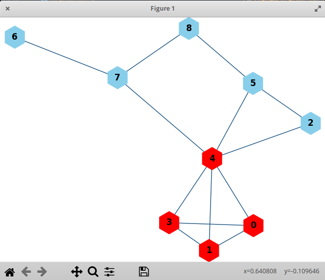
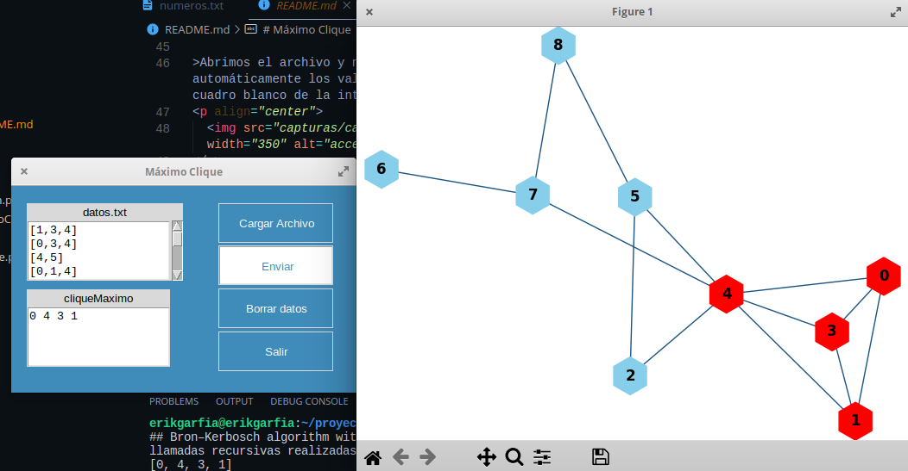
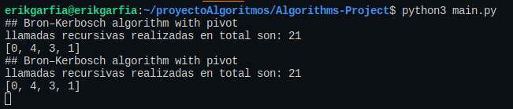

# Máximo Clique con pivote
Autores:
### Garfia Acevedo Erik
### Medero Luján Alejandro

Para compilar el archivo:
> abrir una terminal, te encontrarás en la carpeta raíz de tu terminal

  

> Acceder a la ruta en donde se encuentra la carpeta **ALGORITHMS-PROJECT**.
En mi caso la ruta es la siguiente: **/home/user/proyectoAlgoritmos/Algorithms-Project**

  

>Estando en la carpeta del proyecto ejecutamos el archivo **main.py** con el comando **python3 main.py**

  

>Y obtendremos una salida como la siguiente, dando inicio a la interfaz gráfica.

  

>En la carpeta se encuentra un archivo llamado **numeros.txt** es un ejemplo de un grafo, el cual viene estructurado de la siguiente manera

  

  

>Ahora cargamos el archivo **numeros.txt** presionando el botón **Cargar Archivo**

  

>Y nos aparecera una ventana como la siguiente, en la que nos abrirá de manera inmediata la ruta de la carpeta donde se encuentra el archivo txt

  

>Abrimos el archivo y nos aparecera automáticamente los valores del txt en el cuadro blanco de la interfaz. Podemos observar que en la parte inferior se encuentra otro cuadro de texto llamado **cliqueMaximo**, en esta parte se desplegarán los nodos que contenga el máximo clique.

  

>Seleccionamos el botón de **Enviar** para cargar el archivo txt y obtener como resultado un grafo como el siguiente

  

>En la imagen anterior, se despliega el grafo construido a partir del archivo txt que se cargo, en **rojo** podemos observar los nodos que forman parte del clique máximo, y en **azul** los nodos que no lo son.

>Al observar ambas pantallas, podemos ver que en el cuadro de texto que anteriormente estaba vacío, ahora aparecen los nodos que forman parte del clique máximo.

  

>De igual manera, podemos observar en nuestra terminal nos aparece el total de llamadas recursivas realizadas y los nodos que pertecen al máximo clique.

  

